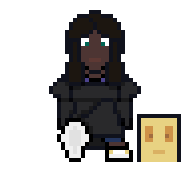

# The Costumemaster (Codename "Conscious")

**Applied AI with GameplayKit**

An acclaimed costume designer and software engineer wakes up from a blackout to an eerily familiar scene. But, something isn't
quite... right.... Traverse through a dream-like, constantly changing bedroom and office and get out as quickly as you can. Can you
make it out and figure out what's going on?

## Features

- 🕹 **Works with Game Center**: Challenge your friends and earn achievements!
- 🍎 **Designed for macOS**: Written completely in Swift, SpriteKit, and GameplayKit!
- ⚙️ **Configurable**: Customize keyboard shortcuts and other preferences with ease!
- 📖 **Open source**:  Licensed under Mozilla Public License v2.0!

## Objective

The primary objective of this project is to take the concepts from _CS440: Principles of Artificial Intelligence_ and build a better 
understanding of agents and apply these concepts by implementing and comparing agents in a video game.

## Roadmap

| Status | Due Date | Milestone |
| ------ | ----------- | ----------- |
| 🟡 | September 21, 2020 | Working Game |
| 🔴 | October 19, 2020 | Adding Apple's agents with GameplayKit |
| 🔴 | November 9, 2020 | Adding custom agents and beating Apple |
| 🔴 | November 16, 2020 | Final presentation and cleanup |

Details on these milestones can be found on the [Milestones page in this repository's issues][milestones].

## Build instructions

### Requirements

- Xcode 11 or higher
- macOS 10.15 (Catalina) or higher
- [KeyboardShortcuts][keys] (added when cloning)
- (Optional, but recommended) [SwiftLint][linter]

Clone the Xcode project, ensure that dependencies are install with the Swift Package Manager, and then run the `Conscious` scheme to 
build the project in Xcode.

### Game Center

The Costumemaster integrates with Game Center to allow players to earn achievements, challenge others, and rank in the leaderboards
for the best scores on levels (scoring system similar to what AI agents use). Game Center is a service that requires an Apple Developer
account and an app registered in App Store connect with the bundle identifier of the game. To test Game Center achievements, make
sure that you update the build identifier in the project to the app's identifier in App Store Connect and make sure that the achievements
with the IDs listed in [GameAchievements.swift][gcachieve] in the Achievements list of the Game Center section.

### About SwiftLint

This project includes support for SwiftLint, a utility that enforces recommended Swift styling practices. While it is not required to install
SwiftLint to build the project, it is highly recommended. The project, during build, will do the following with SwiftLint:

- Resolve any quick, auto-correctable fixes with `swiftlint autocorrect`.
- Run the linter on all source files and present warnings/errors in Xcode after running.

The following practices are also being implemented with SwiftLint:

- Lines should be no longer than 120 characters long, similar to PEP8 standards with Python.
- Function body length will be ignored.
- Bodies for types should not exceed 400 lines (warnings issued at 250 lines).
- Files should not exceed 1000 lines (warnings issued at 500 lines).
- When possible, avoid making a filtered list and iterating over it; use the `for x in x where y` format instead.

## Quick Links

- [Project Proposal](PROPOSAL.md)

---

(C) 2020 Marquis Kurt. All rights reserved. Game Center, the Game Center logo, SF Symbols, and macOS are registered trademarks of 
Apple Inc.

<!-- Links in page -->
[milestones]: https://github.com/alicerunsonfedora/CS400/milestones?direction=asc&sort=due_date&state=open
[linter]: https://realm.github.io/SwiftLint/
[keys]: https://github.com/sindresorhus/KeyboardShortcuts
[gcachieve]: ./Conscious/Enums/GameAchievments.swift
